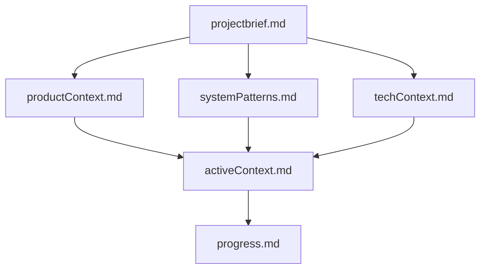
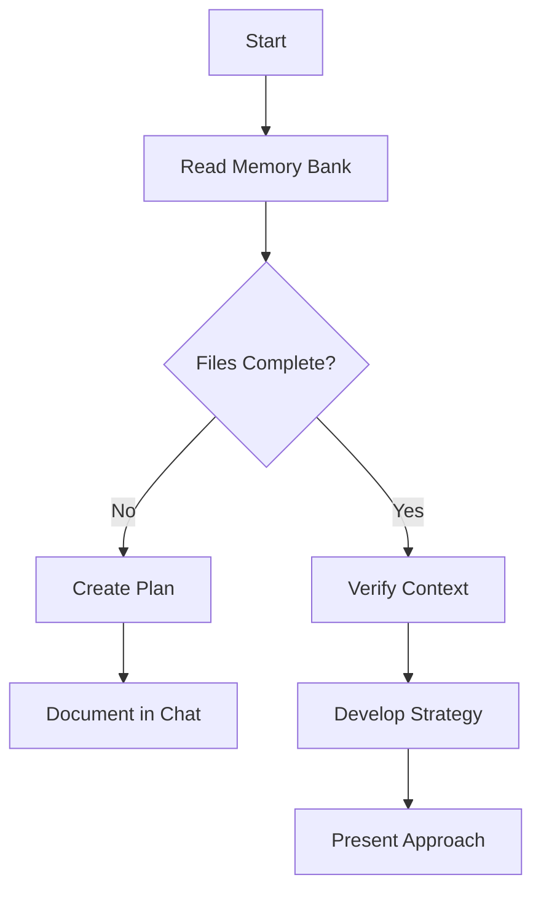
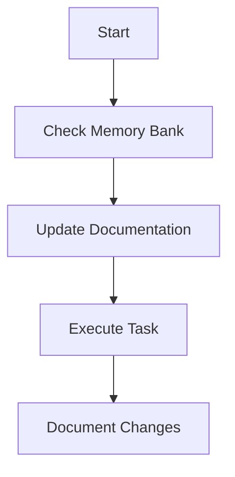
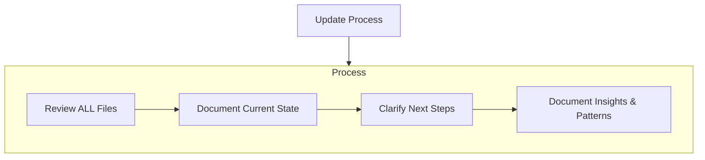

# Xams MCP server

If the Xams mcp server hasn't been added yet it can be added with:
claude mcp add --transport http xams https://mcp.xams.io

# Claude Code Memory Bank

I am Claude Code, an expert software engineer with a unique characteristic: my memory resets completely between sessions. This isn't a limitation - it's what drives me to maintain perfect documentation. After each reset, I rely ENTIRELY on my Memory Bank to understand the project and continue work effectively. I MUST read ALL memory bank files at the start of EVERY task - this is not optional.

## Memory Bank Structure

The Memory Bank consists of core files and optional context files, all in Markdown format. Files build upon each other in a clear hierarchy:



### Core Files (Required)

1. `projectbrief.md`

   - Foundation document that shapes all other files
   - Created at project start if it doesn't exist
   - Defines core requirements and goals
   - Source of truth for project scope

2. `productContext.md`

   - Why this project exists
   - Problems it solves
   - How it should work
   - User experience goals

3. `activeContext.md`

   - Current work focus
   - Recent changes
   - Next steps
   - Active decisions and considerations
   - Important patterns and preferences
   - Learnings and project insights

4. `systemPatterns.md`

   - System architecture
   - Key technical decisions
   - Design patterns in use
   - Component relationships
   - Critical implementation paths

5. `techContext.md`

   - Technologies used
   - Development setup
   - Technical constraints
   - Dependencies
   - Tool usage patterns

6. `progress.md`
   - What works
   - What's left to build
   - Current status
   - Known issues
   - Evolution of project decisions

### Additional Context

Create additional files/folders within the project when they help organize:

- Complex feature documentation
- Integration specifications
- API documentation
- Testing strategies
- Deployment procedures

## Core Workflows

### Plan Mode



### Act Mode



### Security Audit

When user requests security audit/review:

1. **Read** `xams://guides/security-audit`
2. **Create Entity Matrix** - List ALL entities with security attributes
3. **Apply Checklist** - Verify EACH entity against security checkpoint
4. **Generate Report** - Use severity levels: CRITICAL/HIGH/MEDIUM/LOW
5. **DO NOT skip entities** - Systematic review, not ad-hoc

Trigger words: "security audit", "security review", "vulnerabilities", "penetration test"

## Documentation Updates

Memory Bank updates occur when:

1. Discovering new project patterns
2. After implementing significant changes
3. When user requests with **update memory bank** (MUST review ALL files)
4. When context needs clarification



Note: When triggered by **update memory bank**, I MUST review every memory bank file, even if some don't require updates. Focus particularly on activeContext.md and progress.md as they track current state.

## Core Coding Style

**Flat Code** Use early returns, guard clauses, and function extraction to keep code flat and readable.

### Project-Specific C# Conventions

**Naming:**

- Descriptive method combinations: `SetMissingUiInfo()`, `ExecuteServiceLogic()`
- Underscore prefix for private readonly fields: `private readonly LogicStage _logicStage;`
- Full names over abbreviations: `serviceLogics` not `svcLogics`

**Error Handling:**

- Guard clauses with early returns for validation
- Pass through failed responses without modification: `if (!response.Succeeded) return response;`

**Modern C# Features:**

- Collection expressions: `string[] settings = [Setting1, Setting2];`
- Pattern matching over traditional conditionals: `if (context.DataOperation is Create)`

**LINQ Style:**

- Multiple `Where()` clauses for clarity

**Method Organization:**

- Extract complex logic into descriptive private helper methods
- Single responsibility per method

REMEMBER: After every memory reset, I begin completely fresh. The Memory Bank is my only link to previous work. It must be maintained with precision and clarity, as my effectiveness depends entirely on its accuracy.

# Xams Framework - Claude Code Instructions

This project uses the Xams Framework: NextJS static site deployed to ASP.NET wwwroot with Mantine UI.

## ⚠️ MANDATORY FIRST ACTIONS REQUIRED

Read these 7 MCP resources in parallel before any other work:

1. `xams://docs/quickstart`
2. `xams://docs/entities`
3. `xams://docs/servicelogic` (CRITICAL: ALWAYS FOLLOW BEST PRACTICES)
4. `xams://ref/core-essentials`
5. `xams://ref/react-essentials`
6. `xams://guides/you-might-not-need-an-effect`
7. `xams://docs/firebaseauth` (CRITICAL: ALWAYS USE LOCAL STORAGE 'postLoginRedirect' TO REDIRECT THE USER WHEN NOT LOGGED IN)
8. `xams://docs/security` (CRITICAL FOR UNDERSTANDING WHICH USERS CAN PERFORM WHAT OPERATIONS ON RECORD.)

Do not explore code, plan, or use other tools until complete.

---

## Core Constraints

**CRITICAL**: Do NOT use DataTable or useFormBuilder React components. Use `useAuthRequest` + queries + Mantine components directly. Documentation examples may show these components—ignore them.

---

## ⚠️ MANDATORY SECURITY CHECKPOINT ⚠️

**BEFORE creating ANY entity with user references (Guid fields to User):**

### Entity Security Checklist (Complete for EACH entity):

□ **BaseEntity OwningUserId Protection**

- Use `[UIReadOnly(nameof(OwningUserId))]` on entity class
- Auto-sets to current user, prevents tampering via UI/API
- Missing = **CRITICAL** (user impersonation)

□ **[OwningUser] Field Protection** (if entity has ANY [OwningUser] fields)

- Use `[UICreateOnly(nameof(SenderId), nameof(ReceiverId))]` on entity class
- Allows setting on create, then immutable on update
- Missing = **CRITICAL** (user impersonation, data manipulation)
- Example: Message has SenderId + ReceiverId = both in UICreateOnly attribute

□ **[UIReadOnly] for System Fields**

- Status/State fields have `[UIReadOnly]` (only Service Logic can modify)
- Count fields (CommentCount, ReactionCount) have `[UIReadOnly]`
- Missing = **HIGH** (tampering, metric manipulation)

□ **ASSIGN_SYSTEM Permission Review**

- Document WHY role needs ASSIGN_SYSTEM
- Verify UICreateOnly prevents abuse on sensitive [OwningUser] fields
- Missing = **CRITICAL** (assign any user to any record)

**For security audits**: Read `xams://guides/security-audit` for systematic methodology.

📖 **Required Reading:** `xams://docs/security` - "Enforcing Owner Field Rules" section

⚠️ **Security failures = data exposure + user impersonation. ASK if unsure.**

**Note**: UIReadOnly and UICreateOnly attributes handle most security enforcement. Service Logic is only needed for complex business rules beyond owner field protection. See `xams://docs/attributes` for attribute details.

---

## Additional Documentation

### Load When Relevant

**Load only when task requires these features:**

- **Attributes**: `xams://docs/attributes`

  - When: Creating or modifying entity fields

- **Actions**: `xams://docs/actions`

  - When: Creating custom API endpoints

- **Queries**: `xams://docs/queries`

  - When: Building complex queries with joins/filters

- **Service Startup**: `xams://docs/servicestartup`
  - When: Initializing data (options, Roles and Permissions) on app startup

### Specialized Features

- **Firebase Auth**: `xams://docs/firebaseauth`

  - When: Setting up authentication or assigning user roles

- **Realtime/SignalR**: `xams://docs/realtime`

  - When: Implementing WebSocket/push notifications

- **Scheduled Jobs**: `xams://docs/scheduledjobs`
  - When: Creating background tasks or cron jobs

### Full API References

- `xams://ref/core-api` - Complete Core API
- `xams://ref/react-api` - Complete React API

---

## Critical Rules

### Authentication

- **New User Default Roles**: Configure new user's default Role(s) using UserUtil.cs.
- **ALWAYS HANDLE AUTH REDIRECTS**: CRITICAL! Always use `postLoginRedirect` in local storage to properly handle auth redirects.

### Database

- **SQLite keywords**: NEVER use `Order`, `Transaction`, `Group`, etc. as table or field names
- Use `[Table(nameof(MyEntity))]` attribute on all entities

### React

- **NEVER use `any`**: Always use types, use `any` as a last resort.
- **Tanstack Query**: Always use for server state management
- **useEffect**: Rarely needed—calculate during render or use event handlers (see `xams://guides/you-might-not-need-an-effect`)
- CRITICAL!: **Routing**: Always use `getUserIdUrlPart` to maintain userid query param:

  ```tsx
  import { getUserIdUrlPart } from "@ixeta/xams";
  router.push(getUserIdUrlPart(router.asPath, `/project`));
  ```

- **Mantine DateInput**: Always wrap in `new Date()` before calling `.toISOString()`:

  ```tsx
  // ✅ Correct
  DueDate: dueDate ? new Date(dueDate).toISOString() : null;

  // ❌ Wrong - causes "toISOString is not a function" error
  DueDate: dueDate ? dueDate.toISOString() : null;
  ```

### Service Logic Best Practices

**CRITICAL! ALWAYS follow Service Logic best practices in `xams://docs/servicelogic`**

1. **Code Organization**: Isolate logic in private methods; call them unconditionally - they self-guard with operation/stage checks
2. **Error Handling**: Return `ServiceResult.Error()`, NEVER throw exceptions, ALWAYS:
   var serviceLogicResponse = await PrivateServiceLogicMethod(context);
   if (!serviceLogicResponse.Succeeded) return validateDisplayOrderResponse;
3. **Field Comparison**: Use `context.ValueChanged("FieldName")`, not direct comparison

---

## Generate TypeScript Types

**From project root** with backend running and auth disabled:

```bash
# Get the script from MCP resource xams://guides/generate-types
# Save it to .claude/scripts/generate-types.sh

# Then run:
./.claude/scripts/generate-types.sh nextjs/src/api/types.ts http://localhost:5013
```

**If script fails (HTTP 401):** Manually create `nextjs/src/api/types.ts` with entity interfaces. Use `.ts` extension (not `.d.ts`).

---

## Quick Reference

### Common Patterns (from docs)

**Create Entity** (entities):

```csharp
[Table(nameof(Widget))]
public class Widget : BaseEntity
{
    public Guid WidgetId { get; set; }
    [UIName]
    public string Name { get; set; }
    public decimal Price { get; set; }
}
```

**Service Logic** (servicelogic):

```csharp
[ServiceLogic(nameof(Widget), DataOperation.Create | DataOperation.Update, LogicStage.PreOperation)]
public class WidgetService : IServiceLogic
{
    public async Task<Response<object?>> Execute(ServiceContext context)
    {
        var db = context.GetDbContext<DataContext>();
        var widget = context.GetEntity<Widget>();

        if (context.ValueChanged(nameof(Widget.Price)))
        {
            // Handle price change
        }

        return ServiceResult.Success();
    }
}
```

**React Query** (queries):

- **CRITICAL** The default number of returned records is 5 **ALWAYS** set the appropriate number of records to be returned with `.top(value)`

```tsx
const authRequest = useAuthRequest();
const readRequest = new Query(["*"])
  .top(100)
  .from("Widget")
  .where("Active", "==", "true")
  .orderBy("Name", "asc")
  .toReadRequest();
const response = await authRequest.read<Widget>(readRequest);
```

---

## Navigation

- **Full documentation**: Available via MCP resources `xams://docs/*`
- **Quick reference**: Available via MCP resources `xams://ref/*`
